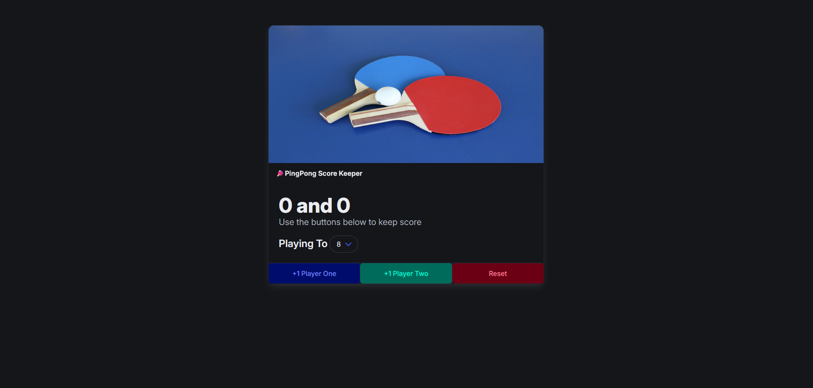

# 🏓 PingPong Score Keeper

A simple PingPong Score Keeper web app built using **HTML, CSS, and JavaScript**. This project allows two players to keep track of their scores and determine a winner based on a selected winning score.

## 🚀 Features

- Select the winning score (3, 5, or 8 points)
- Increment scores for Player One and Player Two
- Automatically detect the Winner and highlight the result
- Reset the game at any time
- Responsive and styled using [Bulma](https://bulma.io/)

## 🛠️ Technologies Used

- **HTML**: Structure of the web app
- **CSS**: Styling with Bulma Framework
- **JavaScript**: Game logic and event handling

## 📂 Project Structure

```
📁 PingPong-Score-Keeper
├── 📄 index.html   # Main HTML file
├── 📄 style.css    # CSS for styling
└── 📄 script.js    # JavaScript logic
```

## 🎮 How to Use

1. Open `index.html` in a web browser.
2. Select the "Playing To" value to set the winning score.
3. Click the "+1 Player One" or "+1 Player Two" buttons to update scores.
4. The game ends when one player reaches the selected score, and their score is highlighted.
5. Click the "Reset" button to restart the game.

## 🖼️ Screenshot



## 🎯 Conclusion

The PingPong Score Keeper is a simple yet effective tool for tracking scores during a friendly ping pong match. With an intuitive interface and responsive design, it enhances the gaming experience by ensuring a fair and fun way to keep score. Future updates will bring even more exciting features to improve usability!
